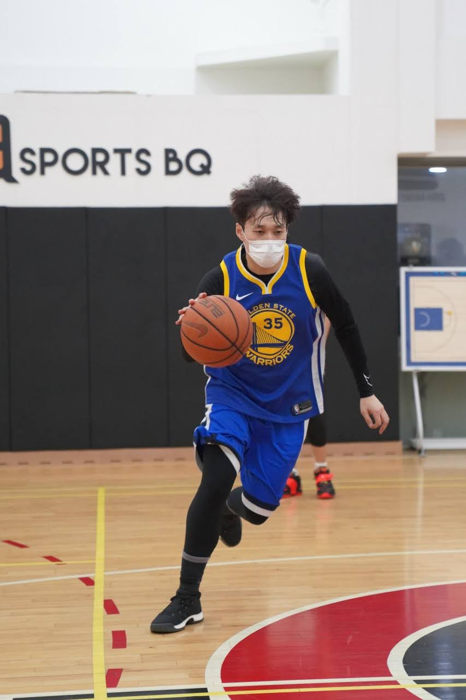
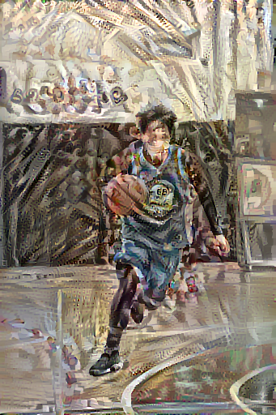

# Project : Neural Style Transfer

- Study Style Transfer (Tensorflow Tutorials).

## My Laptop Env

- CPU : AMD Ryzen 9 5900HS
- RAM : 16GB
- GPU : RTX3070 Lapto GPU(8GB)

## Main Lib Environment

- Python : ver. 3.10.4
- Tensorflow : ver. 2.9.1
- opencv-python : ver. 4.6.0

## Data

- My Pictures

## Model

- VGG19

## Result

- Style of One Image Transfers to Another Image.
- Content
  
- Style
  
- Result
  

- Importance of Style Image.

## More

- Test More Various Model
  - Cycle GAN.
